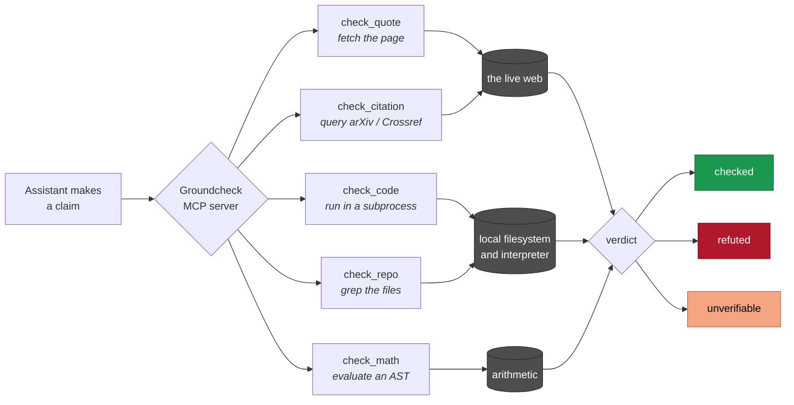
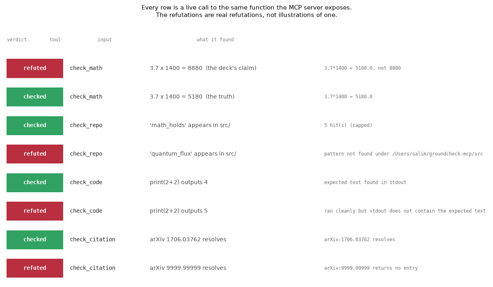

# Groundcheck, verification with no model in the loop

[](https://github.com/aghasalim/groundcheck-mcp/actions/workflows/ci.yml)
[](https://www.python.org/)
[](LICENSE)

An MCP connector that checks whether a claim's **grounding is real**: the quote
is actually on the page, the arXiv id resolves, the code prints what it's said
to, the number is right, with **no language model anywhere in the verification
path**. Works in any MCP host: Claude, Gemini, or another.


---

## Abstract

Assistant "fact-checking" almost always means asking a second model whether the
first was right. That relocates the error rather than removing it, because the
checker hallucinates too. This is an MCP connector that verifies grounding against
reality instead: five tools that fetch a page, resolve an identifier, execute a
snippet, grep a codebase or evaluate an expression, and return one of three
verdicts with the concrete evidence attached.

The scope is deliberately narrow and stated as such. Groundcheck confirms that the
evidence a claim rests on is real and says what it is quoted to say. It does not
judge whether a claim is semantically true, "this quote is on the cited page" is
checkable, "the page's argument is correct" is not, and it returns`unverifiable`
rather than guessing.

No language model is involved in any verdict.

**Contributions.** (i) Verification grounded in sources rather than in a second
model's opinion. (ii) A three-verdict contract with an explicit`unverifiable`, so
refusal is a first-class outcome. (iii) Auditable results, every verdict carries
the quote, stdout, matching line or computed value it was based on.

---

## 1. Why this, and why it's hard

Every "fact-check" built into an assistant today ultimately asks *a second model*
whether the first one was right. That doesn't verify anything, it relocates the
error, because the checker hallucinates too. The genuinely hard, under-attempted
thing is verification grounded in **reality** rather than in another model's
opinion. That's all this does, and it does only that.

**Scope, stated honestly, because over-claiming would defeat the point.**
Groundcheck confirms that the *evidence* a claim rests on is real and says what
it's quoted to say. It does **not** judge whether a claim is semantically true
"this quote is on the cited page" is checkable; "the page's argument is correct"
is not, and no amount of pretending makes it so. Every tool returns one of three
verdicts, and it says`unverifiable` rather than guess:

| verdict | meaning |
|---|---|
|`checked` | the grounding was confirmed against a real source |
|`refuted` | the source exists and contradicts the claim (wrong number, missing quote, dead id, failing code) |
|`unverifiable` | no source, or it needs judgement this tool refuses to fake |



No box in that diagram is a language model. Every verdict terminates at something
that can be looked up, executed or computed.

## 2. The tools

| tool | verifies | how (no LLM) |
|---|---|---|
|`check_quote(quote, url)` | an exact quote is on a page | fetch the page, match the text |
|`check_citation(identifier)` | an arXiv id or DOI resolves | query arXiv / Crossref, return the real title |
|`check_code(snippet, expected_output)` | code prints what's claimed | run it in a subprocess, compare stdout |
|`check_repo(pattern, path)` | a string/regex is in a codebase | grep the files, return real matching lines |
|`check_math(expression, claimed_result)` | arithmetic is correct | evaluate an AST (no`eval`), compare |

Every result is`{status, method, evidence, detail}``evidence` is the concrete
thing found (the quote, the stdout, the matching line, the computed value), so a
verdict is auditable, not a black box.

### 2.1 A live run



Every row above is an actual call to the same function the server exposes,
including the network-dependent arXiv lookups. The refutations are real
refutations rather than illustrations of one, the first row is the`3.7 x 1400`
error from section 3, reproduced.

## 3. It caught a mistake in its own author's work

`check_citation` exists because fabricated-but-plausible arXiv ids kept slipping
into research write-ups, an id that looks right and resolves to nothing.
`check_math` exists because`3.7 × 1400` was written as`8880` in a hardware deck
(it's 5180).`check_repo` is the generalisation of a profile-README claim-checker
that verifies every quoted number against its source repo. Each tool is a failure
that actually happened, turned into a check.

There's one honest wrinkle worth reporting: while testing, I assumed arXiv
`2606.01992` was fabricated and expected`refuted`, the tool returned`checked`.
**The tool was right and I was wrong**: it's a real June-2026 paper. The verifier
did its job against my own bad assumption, which is the entire reason to ground
verification in a source rather than a hunch.

## 4. Use it

```bash
pip install -e .          # or: pip install -r requirements.txt
python -m pytest tests/   # 19 tests, no network needed (mocked transport)
```

**Claude / Claude Code**: add to your MCP config:

```json
{
  "mcpServers": {
    "groundcheck": { "command": "python", "args": ["-m", "src.groundcheck.server"] }
  }
}
```

**Gemini CLI / any MCP host**: same stdio server; point your host's MCP config
at`python -m src.groundcheck.server`. MCP is the reason one connector serves
both.

## 5. Security

`check_code` **executes the code you give it** in a subprocess. It uses list-form
`subprocess` (no shell, so nothing to inject) and kills on timeout, but it is
**not** sandboxed from the network or filesystem. Only pass code you would run
yourself. The other four tools are read-only (HTTP GET, file read, arithmetic).

## 6. Limitations

- **Grounding, not truth.** By design, see Scope above.
- **Quote matching is exact (whitespace-normalised).** A paraphrase that means
  the same thing returns`refuted`, because "means the same" needs a judge and a
  judge is what this tool refuses to be. Match the literal text.
- **JS-rendered pages.**`check_quote` reads the served HTML; a quote injected by
  client-side JavaScript won't be found. It fails safe (`refuted`), never a false
`checked`.
- **arXiv/Crossref only** for citations. Other registries aren't wired up yet.

## 7. Everything here is checked twice

Every verdict this connector returns comes from one implementation,
`src/groundcheck/verify.py`. The tests in `tests/` import that module and assert
what I believed the answers were. They are written in the same language, by the
same person, from the same assumptions, so they cannot catch a mistake in the
thing they import. A precedence bug in the arithmetic evaluator, or an
off-by-one in the hit cap, would pass all 19 of them and be published as a
confirmed fact. That is the failure this project exists to complain about, and I
had it.

So `verify/export_cases.py` freezes what the Python returns for a fixed table of
inputs, and the programs below recompute those same verdicts from the same raw
inputs, in other languages, written from the documented behaviour rather than
from the Python source. `verify/verify.sh` runs them all and exits non-zero if
any two disagree. A wrong answer now has to be wrong identically in six
languages to survive.

```bash
./verify/verify.sh          # skips any toolchain you do not have
```

### What each one recomputes

| language | file | recomputes | from | measured agreement |
|---|---|---|---|---|
| SQL | `verify/summary.sql` | the case summary table below | the three `cases_*.tsv` | 3 of 3 rows identical |
| C | `verify/matheval.c` | every `check_math` verdict and value | `cases_math.tsv` | 27 of 27 verdicts, worst value difference 0.0e+00 relative |
| Go | `verify/gocheck/` | every verdict again, over the real MCP protocol | the live stdio server | 37 of 37 verdicts, worst value difference 0.0e+00 relative |
| R | `verify/repocheck.R` | every `check_repo` verdict and hit count | `cases_repo.tsv` | 10 of 10 verdicts and counts exact |
| Rust | `verify/textcheck/` | every `check_quote` verdict, then a property test | `cases_text.tsv` and the fixtures | 11 of 11 verdicts, 321138 rewrapped quotes still match |
| Node | `verify/mathfuzz.js` | a second parser against the real `check_math` | 200000 random expressions | 181467 agreed, worst value difference 1.7e-9 relative |

The division is deliberate. C takes the arithmetic grammar, because that is the
one tool here that computes rather than looks something up, so it is the one
that can be quietly wrong. R takes `check_repo`, because its two fragile
decisions, escaping a literal pattern and capping the hit count, are invisible
when they are wrong. Rust takes the text pipeline and then does the part Python
is too slow to bother with: it pulls phrases out of the fixtures, rewraps them
with random whitespace and random capitals, and requires every one to still
match, which is the promise section 6 makes. Node writes a second arithmetic
parser and asks the real `check_math` whether its own answer agrees, over
random expressions rather than the ones I thought of. Go is the only one that
does not reimplement anything: it starts the actual server, does the MCP
handshake, and replays every case through `tools/call`, because a tool renamed
or wired to the wrong function would pass every test in this repo and still be
broken for every host.

Nobody writes the same program twice here. There is no Java or Ruby
implementation because there is nothing left for one to check: a second copy of
a kernel that already has two independent implementations proves only that
somebody can copy.

### The case tables

`verify/export_cases.py` writes these, and they are tracked so that CI can
corrupt one and require the harness to notice. SQL recomputes this table with a
group by, and `verify.sh` diffs it against what is printed here.

| table | cases | checked | refuted | unverifiable |
|---|---|---|---|---|
| `cases_math.tsv` | 27 | 17 | 3 | 7 |
| `cases_repo.tsv` | 10 | 6 | 2 | 2 |
| `cases_text.tsv` | 11 | 6 | 4 | 1 |

### It found a real one

The Node fuzz caught something the 19 tests did not. `check_math` used to hand
an overflowing expression straight to the comparison, and

    abs(inf - claimed) <= tol * max(1.0, abs(inf))

is true for every `claimed` there is. So `check_math("1e300*1e300", 42)` returned
**checked**. The tool confirmed an arbitrary claim, which is the one thing it
exists not to do. `1e300**2` was worse in a quieter way: it raised
`OverflowError` out of the tool instead of returning a verdict at all. Both are
now `unverifiable`, which is the honest answer, and a test in
`tests/test_verify.py` pins it. I did not find this by reading the code. A
second parser in another language disagreed with the first, and the harness said
so.

### Regenerating the tables

Only after a deliberate change to the verifiers, and the diff should be read
line by line, because this is the file every other language is held to.

```bash
python verify/export_cases.py
```

## 8. Licence

MIT, see [LICENSE](LICENSE).
