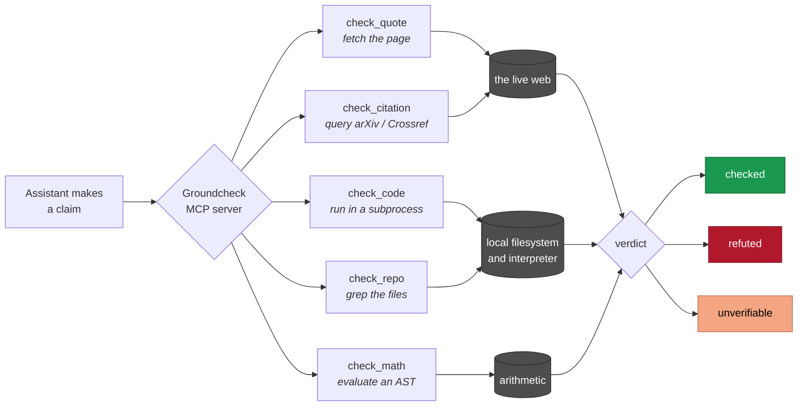
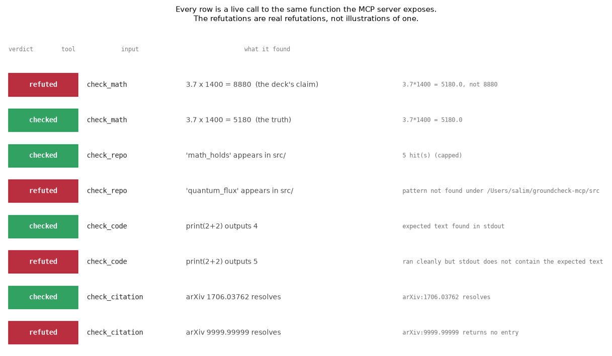

# Groundcheck, verification with no model in the loop

[](https://github.com/aghasalim/groundcheck-mcp/actions/workflows/ci.yml)
[](https://www.python.org/)
[](LICENSE)
[](https://doi.org/10.5281/zenodo.23003639)

I built this MCP connector to check whether the grounding behind a claim is
real. Is the quote actually on the page? Does the arXiv id resolve? Does the
code print what someone says it prints, and is the number right? There's no
language model anywhere in the verification path. It works in any MCP host, so
Claude, Gemini or something else. The checkers under `verify/` re-derive every
verdict it returns. They run against the same fixtures and don't share the
server's code. If a re-derivation drifts, the build stops.


---

## Abstract

When an assistant "fact-checks" something, it almost always asks a second
model whether the first one was right. That just moves the error somewhere
else, since the checker hallucinates too. I wanted to check grounding against
reality instead. Groundcheck has five tools. They fetch a page, resolve an
identifier, run a snippet, grep a codebase or evaluate an expression. Each one
returns one of three verdicts with the evidence attached.

I kept the scope narrow on purpose. Groundcheck confirms that the evidence a
claim rests on is real and says what it's quoted to say. It doesn't judge
whether a claim is semantically true. "This quote is on the cited page" can be
checked. "The page's argument is correct" can't. When it can't tell, it
returns `unverifiable`.

No language model is involved in any verdict.

Contributions. (i) Verification grounded in sources. (ii) A three-verdict
contract with an explicit `unverifiable`, so refusing to answer is a proper
outcome. (iii) Results you can audit, since every verdict carries the quote,
stdout, matching line or computed value it was based on.

---

## 1. Why this, and why it's hard

Almost every "fact-check" built into an assistant today ends up asking *a
second model* whether the first one was right. That doesn't really verify
anything. The checker hallucinates too, so the error just ends up in a
different place. Checking against reality instead of another model's opinion
is the hard part, and few tools attempt it. That's the only thing this one
does.

I want to be careful about scope, since over-claiming would undercut the whole
idea. Groundcheck confirms that the *evidence* a claim rests on is real and
says what it's quoted to say. It doesn't judge whether a claim is semantically
true. "This quote is on the cited page" is checkable. "The page's argument is
correct" isn't, and pretending won't change that. Every tool returns one of
three verdicts. When it can't tell, it says `unverifiable`.

| verdict | meaning |
|---|---|
|`checked` | the grounding was confirmed against a real source |
|`refuted` | the source exists and contradicts the claim (wrong number, missing quote, dead id, failing code) |
|`unverifiable` | no source, or it needs judgement this tool refuses to fake |


```mermaid
flowchart LR
    A["Assistant makes<br/>a claim"] --> M{"Groundcheck<br/>MCP server"}

    M --> Q["check_quote<br/><i>fetch the page</i>"]
    M --> C["check_citation<br/><i>query arXiv / Crossref</i>"]
    M --> X["check_code<br/><i>run in a subprocess</i>"]
    M --> R["check_repo<br/><i>grep the files</i>"]
    M --> T["check_math<br/><i>evaluate an AST</i>"]

    Q & C --> NET[("the live web")]
    X & R --> LOCAL[("local filesystem<br/>and interpreter")]
    T --> PURE[("arithmetic")]

    NET & LOCAL & PURE --> V{"verdict"}
    V --> OK["checked"]
    V --> NO["refuted"]
    V --> UNK["unverifiable"]

    classDef src fill:#4d4d4d,stroke:#2b2b2b,color:#fff
    classDef good fill:#1a9850,stroke:#0f6b33,color:#fff
    classDef bad fill:#b2182b,stroke:#7f0f20,color:#fff
    classDef warn fill:#f4a582,stroke:#c06a4f,color:#000
    class NET,LOCAL,PURE src
    class OK good
    class NO bad
    class UNK warn
```

None of the boxes in that diagram is a language model. Every verdict ends at
something you can look up, run or compute.

## 2. The tools

| tool | verifies | how (no LLM) |
|---|---|---|
|`check_quote(quote, url)` | an exact quote is on a page | fetch the page, match the text |
|`check_citation(identifier)` | an arXiv id or DOI resolves | query arXiv / Crossref, return the real title |
|`check_code(snippet, expected_output)` | code prints what's claimed | run it in a subprocess, compare stdout |
|`check_repo(pattern, path)` | a string/regex is in a codebase | grep the files, return real matching lines |
|`check_math(expression, claimed_result)` | arithmetic is correct | evaluate an AST (no`eval`), compare |

Every result has the shape `{status, method, evidence, detail}`. The
`evidence` field holds whatever was actually found, like the quote, the stdout,
the matching line or the computed value. That's what makes a verdict auditable.

### 2.1 A live run



Each row above is a real call to the same function the server exposes. That
includes the arXiv lookups that need the network. The refutations are real
too. The first row is the `3.7 x 1400` error from section 3, reproduced.

### 2.2 The case corpus

`verify/export_cases.py` writes these tables. I keep them tracked in git so CI
can corrupt one and make sure the harness notices.

| table | cases | checked | refuted | unverifiable |
|---|---|---|---|---|
| `cases_math.tsv` | 27 | 17 | 3 | 7 |
| `cases_repo.tsv` | 10 | 6 | 2 | 2 |
| `cases_text.tsv` | 11 | 6 | 4 | 1 |

## 3. It caught a mistake in its own author's work

I wrote `check_citation` because made-up arXiv ids that looked plausible kept
slipping into research write-ups. They look right and resolve to nothing.
`check_math` exists because `3.7 × 1400` was written as `8880` in a hardware
deck. It's actually 5180. `check_repo` grew out of a claim-checker for my
profile README that compares every quoted number with the repo it came from.
So each tool started as a mistake that really happened.

One thing surprised me. While testing, I assumed arXiv `2606.01992` was
fabricated and expected `refuted`. The tool returned `checked`. It was right
and I was wrong, because it's a real June-2026 paper. The verifier caught my
own bad assumption, and that's exactly why I wanted verification grounded in a
source.

## 4. Use it

```bash
pip install -e .          # or: pip install -r requirements.txt
python -m pytest tests/   # 23 tests, no network needed (mocked transport)
```

For Claude or Claude Code, add this to your MCP config.

```json
{
  "mcpServers": {
    "groundcheck": { "command": "python", "args": ["-m", "src.groundcheck.server"] }
  }
}
```

For Gemini CLI or any other MCP host, it's the same stdio server. Point your
host's MCP config at `python -m src.groundcheck.server`. MCP is why one
connector can serve both.

## 5. Security

`check_code` runs the code you give it in a subprocess. It uses list-form
`subprocess`, so there's no shell and nothing to inject, and it kills the
process on timeout. It isn't sandboxed from the network or the filesystem,
though. Only pass code you'd run yourself. The other four tools are read-only
(HTTP GET, file read, arithmetic).

## 6. Limitations

This checks grounding. It doesn't check truth, and that's by design (see Scope
above).

Quote matching is exact, apart from normalising whitespace. A paraphrase that
means the same thing returns `refuted`. Deciding that two sentences "mean the
same" needs a judge, and this tool refuses to be one. Match the literal text.

`check_quote` reads the served HTML, so it won't find a quote on a JS-rendered
page that client-side JavaScript injects. It fails safe with `refuted` and
never gives a false `checked`.

Citations only go through arXiv and Crossref. Other registries aren't wired up
yet.

## 7. Licence

MIT, see [LICENSE](LICENSE).
